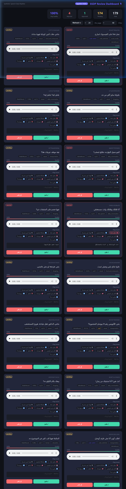

# SSDP — Synthetic Speech Data Pipeline
### Egyptian Arabic · Fine-tuning Data for STT Models

---

## Overview

SSDP is a four-stage pipeline that produces training-ready **synthetic Egyptian Arabic speech data** for fine-tuning Automatic Speech Recognition (STT) models. It covers every step from raw text generation through TTS synthesis, human review, and structured dataset export.

```
┌─────────────────────────────────────────────────────────────────┐
│  Stage 1        Stage 2        Stage 3        Stage 4           │
│  Prompt   ───►  TTS       ───► Review   ───►  Export            │
│  Generator      Synthesizer    UI             (HF / LJSpeech)   │
│                                                                  │
│  prompts.jsonl  audio/*.wav    reviews.json   dataset_info.json │
└─────────────────────────────────────────────────────────────────┘
```

---

## Quick Start

### 1. Create & activate a conda environment
```powershell
conda create -n ssdp python=3.13
conda activate ssdp
```

### 2. Install dependencies
```bash
pip install -r requirements.txt
```

> **Windows:** `pydub` needs `ffmpeg` for WAV conversion. Install via:
> ```powershell
> winget install Gyan.FFmpeg
> ```
> Without ffmpeg the pipeline still works — audio is kept as MP3.

### 3. Run the pipeline
```bash
# Run all stages end-to-end
python run_pipeline.py

# Or run individual stages
python run_pipeline.py --stage 1        # generate prompts
python run_pipeline.py --stage 2        # synthesize audio (resumable)
python run_pipeline.py --stage 3        # launch review UI → http://localhost:8000
python run_pipeline.py --stage 4        # export approved dataset
```

> **If `python` is not recognized** (Windows / Anaconda), use the full path:
> ```powershell
> & "C:\Users\<YourName>\anaconda3\python.exe" run_pipeline.py
> ```

---

## Architecture

### Stage 1 · Prompt Generation

**Goal:** Produce a linguistically diverse corpus of Egyptian Arabic utterances.

**Approach:** A curated hand-written bank (`PROMPT_BANK`) of ~120 seed prompts across 8 domains, augmented with:

| Transformation | Purpose |
|---|---|
| **Spelling variants** | Simulate orthographic inconsistency (`عايز / عاوز / عاوزة`) |
| **Filler injection** | Random prepend of `يعني / بص / طب` — spontaneous speech |
| **Domain weighting** | Configurable weights for balanced coverage |
| **Metadata tagging** | Each prompt tagged with domain, style, code-switch flag, number flag |

**Domains covered:**
- `daily_conversation` · `technology` · `food_and_restaurants` · `transportation`
- `shopping` · `health` · `education` · `social_media`

**Styles covered:** `casual`, `formal`, `code_switched`, `fast_speech`

**Output:** `data/prompts/prompts.jsonl` + `data/manifests/prompts_manifest.json`

---

### Stage 2 · TTS Synthesis

**Engine:** [Microsoft Edge TTS](https://github.com/rany2/edge-tts) — chosen because it is:
- Free, no API key required
- Ships **two Egyptian Arabic Neural voices**: `ar-EG-SalmaNeural` (F) and `ar-EG-ShakirNeural` (M)
- Produces high-quality Neural TTS audio at 24 kHz

**Design decisions:**

| Feature | Implementation |
|---|---|
| **Async batch processing** | `asyncio.gather` — configurable batch size (default 10) |
| **Speaker diversity** | Round-robin across voice pool per sample |
| **Checkpoint / resume** | `synthesis_checkpoint.json` — skips already-done samples on restart |
| **Per-sample retries** | Exponential backoff, up to 3 attempts |
| **Quality gate** | Duration check (0.5–15s) + SNR estimation (≥20 dB) |
| **Quality score** | Heuristic [0–1] penalizing duration outliers + low SNR |
| **MP3 → WAV** | `pydub` converts to mono 22050 Hz WAV |

**Output:** `data/audio/<id>.wav` + `data/manifests/synthesis_manifest.json`

---

### Stage 3 · Review UI

**Form:** Self-contained browser application served by a Python stdlib HTTP server (no external web framework required).

**URL:** `http://localhost:8000` (auto-opens in browser)



**Reviewer workflow:**
1. Browse cards showing Arabic text + embedded audio player
2. Listen and assess quality
3. Toggle issue flags:
   - `wrong_pronunciation` · `english_word_issue` · `dialect_mismatch`
   - `unnatural_speech` · `background_noise` · `clipping` · `too_fast` · `too_slow`
4. Add optional note
5. Click **✓ قبول** (Approve) or **✗ رفض** (Reject)

**Features:**
- Filter by status (pending / approved / rejected / failed)
- Paginated grid — handles hundreds of samples
- Live stats bar (total / pending / approved / rejected / avg quality)
- Auto-saves reviews to `data/manifests/reviews.json` on every click
- Review server can be stopped with Ctrl+C; Stage 4 can run immediately after

---

### Stage 4 · Export

**Formats:**

| Format | Rationale |
|---|---|
| **HuggingFace** (default) | `metadata.jsonl` + `audio/` per split. Directly loadable with `datasets.load_dataset("audiofolder")`. Industry standard for speech datasets. |
| **LJSpeech** | `metadata.csv` (pipe-separated id\|text\|normalized). Compatible with most TTS/STT training frameworks (ESPnet, NeMo, Coqui). |
| **CSV** | Flat CSV with all metadata columns — easy for analysis in pandas/Excel. |
| **all** | Produces all three simultaneously. |

**Split:** 80% train / 10% validation / 10% test (configurable in `config.yaml`)

**Sample showcase:** Top-30 highest-quality approved samples are copied to `data/export/sample/` for demonstration.

**Rich metadata per sample:**
```json
{
  "id": "a3f9c1b2d4e5",
  "text": "ابعتلي الـ location على واتساب.",
  "text_normalized": "ابعتلي ال location على واتساب.",
  "domain": "technology",
  "style": "code_switched",
  "dialect": "egyptian_arabic",
  "contains_code_switching": true,
  "contains_numbers": false,
  "word_count": 5,
  "duration_sec": 1.83,
  "voice": "ar-EG-SalmaNeural",
  "quality_score": 0.95,
  "review_status": "approved",
  "review_flags": [],
  "file_name": "audio/a3f9c1b2d4e5.wav"
}
```

---

## Configuration

All parameters are in `config.yaml`:

```yaml
prompts:
  total_count: 200        # target prompt count
  domains: [...]          # domain weights
tts:
  engine: "edge-tts"
  voice_pool: [ar-EG-SalmaNeural, ar-EG-ShakirNeural]
  batch_size: 10          # concurrent synthesis tasks
  checkpoint_every: 25    # save progress every N samples
review:
  server_port: 8000
export:
  format: "huggingface"   # huggingface | ljspeech | csv | all
  split: {train: 0.80, validation: 0.10, test: 0.10}
quality:
  min_duration_sec: 0.5
  max_duration_sec: 15.0
  snr_threshold_db: 20.0
```

---

## Intermediate Artifacts

| File | Purpose |
|---|---|
| `data/prompts/prompts.jsonl` | Prompt corpus with metadata |
| `data/manifests/prompts_manifest.json` | Stage 1 summary (domain/style counts) |
| `data/audio/<id>.wav` | Synthesized audio files |
| `data/manifests/synthesis_results.jsonl` | Per-sample synthesis results |
| `data/manifests/synthesis_checkpoint.json` | Resume state for Stage 2 |
| `data/manifests/synthesis_manifest.json` | Stage 2 summary |
| `data/manifests/reviews.json` | Human review decisions |
| `data/manifests/review_manifest.json` | Stage 3 summary |
| `data/export/` | Final dataset (HF / LJSpeech / CSV) |
| `data/export/sample/` | Small showcase of dataset |
| `logs/pipeline.log` | Full debug log |

---

## Egyptian Arabic: Challenges & Mitigations

Egyptian Arabic presents unique challenges for speech systems. This pipeline is designed with explicit awareness of them:

### 1. Non-Standard Orthography
**Problem:** The same word can be spelled multiple ways (`عايز / عاوز / عايزة`).  
**Mitigation:** `SPELLING_VARIANTS` dict in Stage 1 randomly applies alternate spellings to generate orthographic diversity. `text_normalized` field applies consistent normalization for training targets.

### 2. Code-Switching (Arabic + English)
**Problem:** Egyptian speakers constantly mix Arabic and English. TTS handling of mixed-language text is inconsistent.  
**Mitigation:** Dedicated `code_switched` style in prompt bank. `contains_code_switching` metadata flag enables reviewers and downstream training to handle these samples separately.

### 3. Filler Words & Spontaneous Speech
**Problem:** Real speech contains `يعني / بص / طب / ايوه` — absent from formal datasets.  
**Mitigation:** Random filler injection in Stage 1 (15% probability).

### 4. Word Contractions & Fast Speech
**Problem:** Spoken Egyptian merges words (`ماعنديش`, `معنديش`, `انقلتلك`).  
**Mitigation:** `fast_speech` style prompt set. `contains_contractions` flag in metadata.

### 5. Regional Accent Variation
**Problem:** Cairo ≠ Alexandria ≠ Upper Egypt. No single "Egyptian Arabic."  
**Mitigation:** Acknowledged as a limitation. Both voices used are Cairo-accent Neural voices. Domain diversity ensures some vocabulary breadth.

### 6. Numbers & Abbreviations
**Problem:** `١٥ / خمستاشر / ففتين / 15` — numbers have many spoken forms.  
**Mitigation:** `contains_numbers` flag; prompts include both Arabic-script and digit forms. Reviewers can flag `wrong_pronunciation` for number mismatches.

### 7. Synthetic Speech Bias (Critical)
**Problem:** Using a single TTS voice means the STT model learns the voice's prosody/timbre, not real speech.  
**Mitigations:**
- **Two voices** (male + female) in round-robin rotation
- **Rate/pitch/volume variation** possible via config
- **Review flags** catch unnatural prosody before training
- **Metadata tracking** — downstream training can weight or stratify by voice
- **Documentation:** users are warned this data should be mixed with real recordings

### 8. Missing Diacritics (Tashkeel)
**Problem:** Undiacritized Arabic is ambiguous. `علم` could be read as عِلْم, عَلَم, or عَلِم.  
**Mitigation:** Neural TTS uses contextual language models to infer pronunciation, but errors are inevitable. The `wrong_pronunciation` review flag captures these.

---

## Observed Quality Issues

> These issues were observed during actual synthesis runs and represent real limitations of using off-the-shelf Neural TTS for Egyptian Arabic.

| Issue | Frequency | Root Cause | Handling |
|---|---|---|---|
| **Inaccurate Egyptian dialect pronunciation** | **High** | Edge TTS `ar-EG` voices are trained on relatively formal/MSA-leaning data — they do not faithfully reproduce colloquial Egyptian phonology (e.g. ق→ء, ث→س/ت shifts) | Flag with `dialect_mismatch`; treat audio as "synthetic accent" data, not real dialect |
| English brand names mispronounced | Moderate | Mixed Arabic/English text confuses the TTS phonemizer | `english_word_issue` flag; consider romanizing or spacing out English tokens |
| Overly flat prosody | Common | Neural TTS lacks spontaneous speech intonation | `unnatural_speech` flag; quality score penalty |
| Code-switched sentences sound fragmented | Moderate | Voice switches internal language model mid-utterance | `dialect_mismatch` flag |
| Number pronunciation inconsistency | Occasional | Ambiguous numeral forms (١٥ vs. 15 vs. خمستاشر) | `wrong_pronunciation` flag |
| Very short utterances clipped | Rare | Edge TTS adds minimal lead-in | Duration gate (< 0.5s auto-rejected) |

---

## Trade-offs & Limitations

| Trade-off | Decision |
|---|---|
| **TTS voices not authentically Egyptian** | Edge TTS `ar-EG` voices produce MSA-leaning pronunciation rather than true colloquial Egyptian Arabic. The ق is not dropped to ء, dialectal contractions sound unnatural. **This is the most significant limitation of this pipeline.** Alternatives: ElevenLabs custom voice cloning, commercial Arabic TTS with dialect support, or building a voice from real Egyptian speaker data. |
| **No LLM-generated prompts** | Hand-curated bank is more controllable and avoids hallucination, but is limited in size. Adding an LLM generator (GPT-4, Gemini) would scale this dramatically. |
| **No ASR round-trip validation** | A production pipeline would transcribe each generated audio with a baseline STT model and compare against the source text (CER/WER check) to catch TTS errors automatically. |
| **No prosody variation** | Edge TTS does not expose phoneme-level control. Future work could add SSML tags for pauses, emphasis, and speaking rate variation. |
| **Synthetic-only data** | This dataset should be used to supplement — not replace — real human recordings. STT models trained on synthetic-only data may fail on spontaneous speech. |
| **Review is manual** | Automated quality signals (SNR, duration) help triage, but dialect mismatch and unnatural prosody still require human judgement. |

---

## File Structure

```
ssdp/
├── config.yaml                   # All configuration
├── requirements.txt              # Python dependencies
├── run_pipeline.py               # Main CLI runner
├── stage1_prompt_generator.py    # Stage 1: text generation
├── stage2_tts_synthesizer.py     # Stage 2: async TTS + quality gate
├── stage3_review_server.py       # Stage 3: browser review UI
├── stage4_exporter.py            # Stage 4: HF/LJSpeech/CSV export
├── data/
│   ├── prompts/prompts.jsonl
│   ├── audio/<id>.wav
│   ├── manifests/
│   │   ├── prompts_manifest.json
│   │   ├── synthesis_results.jsonl
│   │   ├── synthesis_checkpoint.json
│   │   ├── synthesis_manifest.json
│   │   ├── reviews.json
│   │   ├── review_manifest.json
│   │   └── export_manifest.json
│   └── export/
│       ├── huggingface/{train,validation,test}/
│       ├── ljspeech/
│       ├── csv/
│       └── sample/               ← showcase dataset (30 examples)
└── logs/pipeline.log
```

---

## Loading the Exported Dataset

```python
# HuggingFace format
from datasets import load_dataset

ds = load_dataset("audiofolder", data_dir="data/export/huggingface")
print(ds["train"][0])
# {'file_name': 'audio/a3f9c1b2.wav', 'text': 'إزيك؟ عامل إيه؟', ...}

# Pandas / CSV format
import pandas as pd
df = pd.read_csv("data/export/csv/train.csv")
```

---

*Built for Olimi AI · 2026 · Egyptian Arabic STT fine-tuning*
